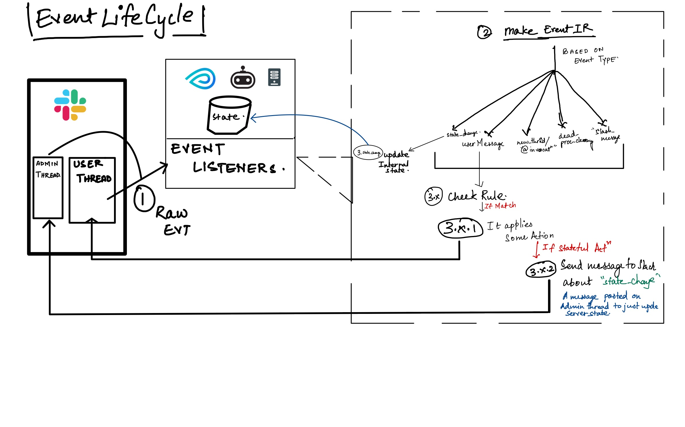

# Event Lifecycle of Bot


The `MFBServer` listens to events from slack via `MFBSlackClientV2`and converts then to internal event representation. These events are matched with rules to and based on the matched rules an action is invoked.

In the above event lifecycle, the `metaflowbot` uses Slack as a stateful store for storing context about threads. When the Bot detects a `state_change` event, its stores its contents in the `MFBState` [Object](../metaflowbot/state.py).

## Core Objects

- `MFBServer` is present in [metaflowbot.server](../metaflowbot/server.py). This class is the server that parses messages from slack events, applies rules and invokes actions based on the matched rules.

- `MFBSlackClientV2` is present in [metaflowbot.slack_client](../metaflowbot/slack_client.py). This class provides a wrapper over slack APIs.

- `MFBRules` is present in [metaflowbot.rules](../metaflowbot/rules.py). This class helps match rules with events.

- `MFBState` is present in [metaflowbot.state](../metaflowbot/rules.py). This class helps hold state about the open threads and conversations with users. It is used by `MFBServer`.

- [metaflowbot.actions](../metaflowbot/actions) is the subpackage that holds all the actions of the bot. Ways to create new subpackages can be found [here](./Create-Your-Action.md).

## Event Lifecycle Psuedo Code
```python

while server runs forever: # metaflowbot.server.MFBServer.loop_forever()
    foreach event from slack: # metaflowbot.slack_client.MFBSlackClientV2.rtm_events()
        convert events to MFBot Compatible events: # metaflowbot.server._make_events(event)
            if event matches rules: # metaflowbot.rules.MFBRules.match(event,rule)
                apply action matches by rule # metaflowbot.server.actions
                # Calls MFBServer._take_action
                # Every action is invoked as a seperate python process.
```

## Events

### `lost_process`

> Event created when processed dead processes are detected **(?)**
### `new_thread`

> When a completely new thread is created
### `user_message`

> When a user messages on a thread
